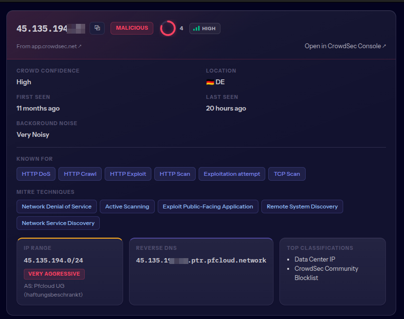
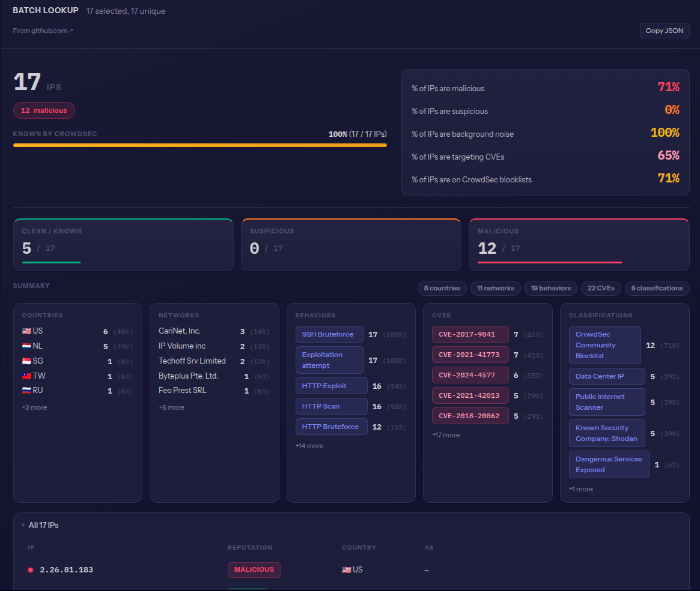
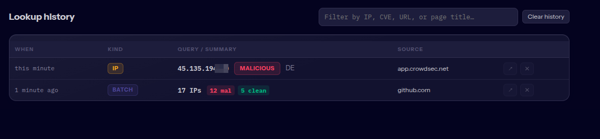
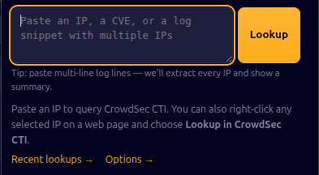

# CrowdSec CTI Lookup — Chrome Extension

A zero-build Chrome extension (Manifest V3) that enriches any IP you see in
the browser with CrowdSec CTI threat-intelligence context. Visual style is
aligned with the CrowdSec [ipdex-ui](https://github.com/crowdsecurity/ipdex-ui)
web app so the two feel like one product.

## Features

- **Right-click lookup** — select text with one or more IPs on any web page,
  choose **Lookup in CrowdSec CTI**, and get a drawer-style card with
  reputation, score, confidence, geo, ASN, behaviors, MITRE techniques, CVEs
  the IP has been seen targeting, and more.
- **Batch mode** — paste or select many IPs (log lines, CSV, paragraphs) and
  get a batch summary: clean/suspicious/malicious KPI cards, insights panel,
  top countries/networks/behaviors/CVEs/classifications, and a sticky-header
  IP table.
- **Toolbar popup** — paste/type an IP or CVE for a manual lookup without
  leaving the tab.
- **Lookup history** — every successful lookup is recorded locally; a
  dedicated page lists them newest-first with filter, remove, and one-click
  replay.
- **Source-URL capture** — each history entry remembers which page the
  selection came from, so you can trace an IP back to where you saw it.
- **Quota-aware caching** — responses are cached (`chrome.storage.local`,
  LRU) so re-opening a recent lookup or replaying a batch doesn't burn
  community-tier quota.
- **Offline-friendly** — fonts (Instrument Sans, IBM Plex Mono) are bundled
  inside the extension, no runtime network calls to Google Fonts.

## Screenshots

Single IP lookup:



Batch lookup across multiple IPs:



Lookup history (filter + replay):



Toolbar popup:



## Disclaimer

This is a vibe coded experiment, use at your own risk.

## Install (unpacked)

1. Clone / download this folder to your machine.
2. Visit `chrome://extensions` and enable **Developer mode** (top-right).
3. Click **Load unpacked** and select the `chrome-plugin/` directory.
4. The extension icon appears in the toolbar.

## Set up your API key

1. Get a free community API key from
   [app.crowdsec.net → Settings → API Keys](https://app.crowdsec.net/settings/cti-api-keys).
2. Right-click the extension icon → **Options** (or click it and follow the link).
3. Paste the key, click **Test CTI** to validate, then **Save**.

## Usage

- On any web page, highlight text containing one or more IPs, right-click,
  and pick **Lookup in CrowdSec CTI**.
  - One IP → a single-IP card opens in a detached popup.
  - Many IPs (or a mix of IPs and CVEs) → the batch summary opens in a wider
    window.
- Click the toolbar icon for the manual-input popup.
- CVE chips in the "Known For" section open the matching CrowdSec
  [LET](https://tracker.crowdsec.net) page in a new tab.

### History & source capture

Every successful lookup is appended to a local history:

- **Open the history page**: click the toolbar icon → **Recent lookups →** in
  the popup.
- **Per entry**, we store the query (IP / CVE / IP list for batches), a
  compact summary (reputation, score, country, or clean/suspicious/malicious
  counts for batches), the source page URL + title, and a timestamp.
- **Replay**: clicking a row re-opens the result window. Single-IP and CVE
  entries reuse the response cache; batch entries rebuild their session
  payload so the cached responses serve most or all IPs without quota cost.
- **Filter**: the search box matches IPs, CVEs, URLs, and page titles in real
  time.
- **Cap**: 200 entries, LRU eviction. **Clear history** wipes them on
  demand. No opt-in is required — recording happens automatically, locally.

## File layout

```
chrome-plugin/
├── manifest.json          # MV3 manifest
├── background.js          # service worker — context menu + routing
├── lib/
│   ├── crowdsec.js        # CTI API wrapper (+ stubbed CVE)
│   ├── detect.js          # IP / CVE classifier
│   ├── cache.js           # TTL cache for CTI responses (chrome.storage.local)
│   ├── history.js         # LRU-capped lookup history (chrome.storage.local)
│   ├── storage.js         # API-key helpers
│   └── render.js          # shared IP-card + batch-summary renderer
├── options/               # Options page (paste/test key)
├── popup/                 # Toolbar popup
├── result/                # Detached result window
│   └── fonts/             # Bundled Instrument Sans + IBM Plex Mono
├── history/               # Lookup-history page
└── icons/                 # Placeholder PNGs (16/32/48/128)
```

## Privacy & data locality

- **API key** lives in `chrome.storage.local` on your machine and is
  transmitted only to `cti.api.crowdsec.net` — enforced by the extension's
  `host_permissions`, which allow no other hosts.
- **No content script** is injected on web pages. The extension only ever
  sees text you explicitly right-click on, via `info.selectionText`.
- **Source URLs** recorded in history (page URL + title of the tab you
  right-clicked on) are stored in `chrome.storage.local` and are **never
  transmitted anywhere** — not to CrowdSec, not to third parties. They exist
  purely to let you trace a history entry back to the page it came from.
- **CTI responses** are cached locally for re-use. Cache + history both sit
  under `chrome.storage.local`; remove them at any time via
  `chrome://extensions` → the extension's details → **Extension options**
  (for the API key) or **Clear history** on the history page. Uninstalling
  the extension wipes everything.
- **No analytics, no telemetry, no network calls** other than the CTI API
  requests you trigger. Fonts are bundled in `result/fonts/` so rendering
  the UI does not hit Google Fonts.
